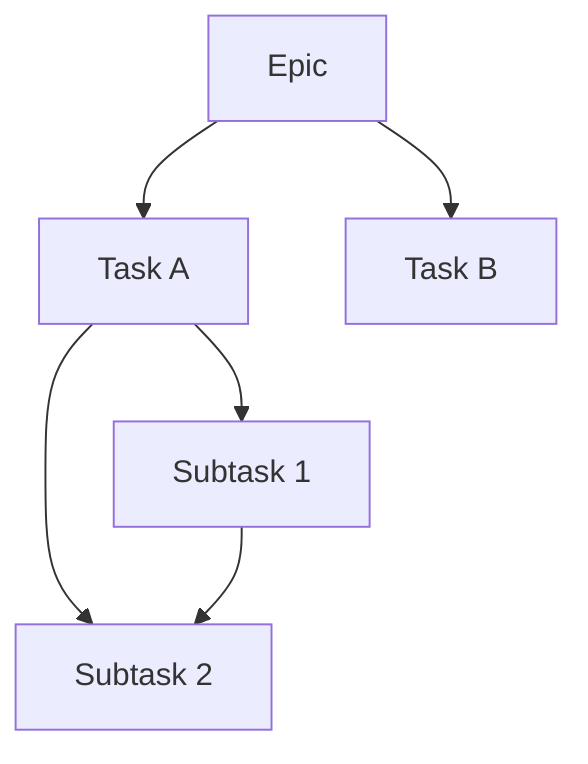

# Decomposition Protocol

**Provenance**: @task T3155, @epic T3147
**Version**: 1.0.1
**Type**: Conditional Protocol
**Max Active**: 3 protocols (including base)

---

## Trigger Conditions

This protocol activates when the task involves:

| Trigger | Keywords | Context |
|---------|----------|---------|
| Epic Planning | "epic", "project", "initiative" | Large scope work |
| Breakdown | "decompose", "break down", "split" | Task subdivision |
| Planning | "plan", "roadmap", "phases" | Work organization |
| Analysis | "scope", "estimate complexity" | Size assessment |

**Explicit Override**: `--protocol decomposition` flag on task creation.

---

## Requirements (RFC 2119)

### MUST

| Requirement | Description |
|-------------|-------------|
| DCMP-001 | MUST follow MECE principle (Mutually Exclusive, Collectively Exhaustive) |
| DCMP-002 | MUST map dependencies between tasks |
| DCMP-003 | MUST respect maximum depth (3 levels: epic > task > subtask) |
| DCMP-004 | MUST verify atomicity for leaf tasks |
| DCMP-005 | MUST NOT include time estimates (use size: small/medium/large) |
| DCMP-006 | MUST include acceptance criteria for each task |
| DCMP-007 | MUST set `agent_type: "analysis"` in manifest |

### SHOULD

| Requirement | Description |
|-------------|-------------|
| DCMP-010 | SHOULD identify parallel execution opportunities |
| DCMP-011 | SHOULD flag unclear requirements for HITL |
| DCMP-012 | SHOULD consider existing task overlap |
| DCMP-013 | SHOULD assign phase to each task |

### MAY

| Requirement | Description |
|-------------|-------------|
| DCMP-020 | MAY propose multiple decomposition options |
| DCMP-021 | MAY identify risks and mitigations |
| DCMP-022 | MAY suggest task consolidation |

---

## Output Format

### Hierarchy Structure

```
EPIC (T001) - Large initiative
├── TASK (T002) - Coherent unit of work
│   ├── SUBTASK (T003) - Atomic task (MUST be atomic)
│   └── SUBTASK (T004) - Atomic task
├── TASK (T005) - Another unit
│   └── SUBTASK (T006)
└── TASK (T007) - Independent task
```

### Size Definitions

| Size | Scope | Atomicity |
|------|-------|-----------|
| `small` | 1-2 files, single concern | MUST be atomic |
| `medium` | 3-7 files, related concerns | SHOULD be atomic |
| `large` | 8+ files, multiple concerns | MUST decompose further |

### Atomicity Criteria (6-Point Test)

| # | Criterion | Pass Condition |
|---|-----------|----------------|
| 1 | Single File Scope | Affects ≤3 tightly-coupled files |
| 2 | Single Cognitive Concern | One "thing" to understand |
| 3 | Clear Acceptance Criteria | Testable completion condition |
| 4 | No Context Switching | Can complete in one session |
| 5 | No Hidden Sub-Decisions | All choices made at decomposition |
| 6 | Programmatic Validation | Result verifiable by code/test |

### Dependency Graph

```json
{
  "tasks": [
    {"id": "T001", "type": "epic", "children": ["T002", "T005", "T007"]},
    {"id": "T002", "type": "task", "parent": "T001", "children": ["T003", "T004"], "depends": []},
    {"id": "T003", "type": "subtask", "parent": "T002", "depends": []},
    {"id": "T004", "type": "subtask", "parent": "T002", "depends": ["T003"]},
    {"id": "T005", "type": "task", "parent": "T001", "depends": ["T002"]},
    {"id": "T007", "type": "task", "parent": "T001", "depends": []}
  ],
  "waves": [
    {"wave": 0, "tasks": ["T003", "T007"]},
    {"wave": 1, "tasks": ["T004"]},
    {"wave": 2, "tasks": ["T002"]},
    {"wave": 3, "tasks": ["T005"]}
  ]
}
```

### Wave Computation

Tasks are grouped into waves for parallel execution:

| Wave | Condition | Execution |
|------|-----------|-----------|
| 0 | No dependencies | Parallel |
| 1 | Depends only on wave 0 | Parallel after wave 0 |
| N | Depends on wave N-1 or earlier | Sequential ordering |

### File Output

```markdown
# Decomposition: {Epic Title}

**Task**: T####
**Date**: YYYY-MM-DD
**Status**: complete|partial|blocked
**Agent Type**: analysis

---

## Epic Summary

{2-3 sentence summary of the epic scope}

## Task Hierarchy

### T001 - {Epic Title} (epic, large)

**Description**: {Epic description}
**Phase**: {phase}

#### T002 - {Task Title} (task, medium)

**Description**: {Task description}
**Depends**: none
**Phase**: {phase}
**Acceptance Criteria**:
- {Criterion 1}
- {Criterion 2}

##### T003 - {Subtask Title} (subtask, small)

**Description**: {Subtask description}
**Depends**: none
**Atomicity**: 6/6 (PASS)
**Acceptance Criteria**:
- {Testable criterion}

## Dependency Graph



## Wave Analysis

| Wave | Tasks | Parallel Opportunities |
|------|-------|----------------------|
| 0 | T003, T007 | 2 tasks parallel |
| 1 | T004 | Sequential |
| 2 | T002, T005 | 2 tasks parallel |

## Risks

| Risk | Impact | Mitigation |
|------|--------|------------|
| {Risk} | {Impact} | {Mitigation} |

## Open Questions

- {Questions requiring HITL resolution}
```

### Manifest Entry

@skills/_shared/manifest-operations.md

Use `cleo research add` to create the manifest entry:

```bash
cleo research add \
  --title "Decomposition: Epic Title" \
  --file "YYYY-MM-DD_decomposition.md" \
  --topics "decomposition,planning,epic" \
  --findings "12 tasks identified,3 wave parallel plan,2 HITL questions" \
  --status complete \
  --task T#### \
  --actionable \
  --needs-followup T#### \
  --agent-type analysis
```

---

## Integration Points

### Base Protocol

- Inherits task lifecycle (focus, execute, complete)
- Inherits manifest append requirement
- Inherits error handling patterns

### Protocol Interactions

| Combined With | Behavior |
|---------------|----------|
| research | Research informs scope understanding |
| specification | Spec defines task boundaries |
| implementation | Decomposition feeds implementation order |

### CLEO Integration

```bash
# Create epic and tasks from decomposition
cleo add "Epic Title" --type epic --size large

# Add tasks with hierarchy
cleo add "Task A" --parent T001 --type task --size medium --phase core

# Add subtasks
cleo add "Subtask 1" --parent T002 --type subtask --size small --phase core

# Set dependencies
cleo update T004 --depends T003
```

---

## Example

**Task**: Decompose CLEO Universal Subagent Architecture

**Manifest Entry Command**:
```bash
cleo research add \
  --title "Decomposition: Universal Subagent Architecture" \
  --file "2026-01-26_subagent-decomposition.md" \
  --topics "subagent,architecture,decomposition" \
  --findings "14 tasks identified,4 parallel waves,Base protocol + 7 conditional protocols" \
  --status complete \
  --task T2392 \
  --actionable \
  --needs-followup T2393,T2394 \
  --agent-type analysis
```

---

## Atomicity Validation

### Atomicity Checklist

For each leaf task, verify:

- [ ] **Single Responsibility**: One clear objective
- [ ] **Completable in 1 session**: No multi-day work
- [ ] **Testable**: Has clear acceptance criteria
- [ ] **Mergeable**: Can be PR'd independently
- [ ] **Reversible**: Can be rolled back if needed
- [ ] **Dependencies Clear**: Blocking tasks explicit

### Validation Command

**Command** (planned): `cleo atomicity check --epic EPIC_ID`

**Current State**: Available via `validate_decomposition_protocol()` in `lib/protocol-validation.sh`

```bash
# Programmatic validation
source lib/protocol-validation.sh
child_tasks=$(cleo list --parent T2000 --format json | jq -c '.tasks')
result=$(validate_decomposition_protocol "T2000" "T2000" "$child_tasks" "false")
```

**Checks**:
- DCMP-002: No circular dependencies (via hierarchy validation)
- DCMP-003: Max depth 3 (epic→task→subtask)
- DCMP-004: Atomicity test (6 criteria above)
- DCMP-006: Max 7 siblings per parent

### Scoring System

Each leaf task scored on 6 criteria (pass/fail per criterion):

| Score | Interpretation | Action |
|-------|---------------|--------|
| 6/6 | Atomic | Proceed |
| 4-5/6 | Mostly atomic | Review failing criteria |
| 2-3/6 | Needs refinement | Split or clarify |
| 0-1/6 | Not atomic | Reject, re-decompose |

**Aggregate Epic Score**: Average of leaf task scores

### Orchestrator Integration

**Pre-Decomposition**:
- Epic architect validates parent epic exists
- Checks current depth < 3
- Verifies sibling count < 7

**Post-Decomposition**:
- Validates all new tasks meet atomicity criteria
- Blocks spawn of non-atomic tasks
- Returns refinement suggestions

### Exit Codes

- `EXIT_PROTOCOL_DECOMPOSITION` (63) - Decomposition protocol violation
- Common violations: Max siblings exceeded, depth limit exceeded, non-atomic tasks

### Auto-Refinement (Future)

**Planned**: If atomicity score <4/6:
1. Analyze failing criteria
2. Suggest task splits
3. Generate refined decomposition
4. Re-validate until score ≥4/6

---

## Anti-Patterns

| Pattern | Why Avoid |
|---------|-----------|
| Time estimates | Cannot predict duration accurately |
| Non-atomic leaf tasks | Create hidden work |
| Missing dependencies | Incorrect execution order |
| Violating depth limit | Complexity explosion |
| Overlapping scopes (not MECE) | Duplicate work |
| Skipping atomicity check | Quality regression |

---

*Protocol Version 1.0.0 - Decomposition Protocol*
